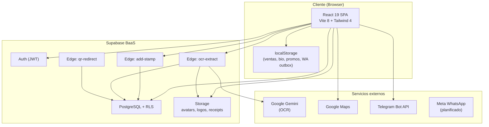

# Informe de Consultoría — Fidelicard / AiLink Hub

**Cliente:** Fidelicard Platform  
**Tipo de engagement:** Auditoría de arquitectura, modelo de negocio, riesgos, gobernanza, pruebas y seguridad  
**Fecha:** 17 de junio de 2026  
**Versión del producto analizada:** commit en rama `master` (SPA React + Supabase)

---

## 1. Resumen ejecutivo

Fidelicard (marca comercial **AiLink Hub**) es una **plataforma modular co-branded** orientada a PYMES colombianas. Combina fidelización digital, biografías de negocio, ventas asistidas por IA, promociones geolocalizadas y propinas digitales bajo un mismo shell de autenticación y administración.

El núcleo productivo más maduro es el **módulo de fidelización** (`fidelizacion`), respaldado por PostgreSQL (Supabase), Row Level Security (RLS), Storage y tres Edge Functions (`add-stamp`, `ocr-extract`, `qr-redirect`). Los demás módulos (`ventas`, `biografias`, `promociones`, `napilink`, panel `admin`) están en distintos grados de **prototipo funcional**: gran parte persiste en `localStorage` o datos semilla (`seed.ts`), sin backend unificado.

**Hallazgo principal:** existe una brecha significativa entre la **visión de plataforma enterprise** (multi-módulo, admin cross-module, pagos, CRM, IA) y la **realidad técnica actual** (un solo dominio de datos persistente en Supabase, guards solo en frontend, ausencia total de pruebas automatizadas y CI/CD).

**Recomendación estratégica:** priorizar la **consolidación del módulo Fidelik** como producto comercializable (MVP), endurecer seguridad server-side y establecer gobernanza mínima antes de escalar comercialmente los módulos secundarios.

---

## 2. Contexto y modelo de negocio

### 2.1 Propuesta de valor

| Módulo | Marca comercial | Propuesta | Estado de madurez |
|--------|-----------------|-----------|-------------------|
| `fidelizacion` | **Fidelik** | Tarjetas de lealtad digitales, sellos/puntos, registro de compras con OCR de recibos, QR, CRM básico, notificaciones WhatsApp | **Producción parcial** — backend real en Supabase |
| `biografias` | **BioLink** | Páginas públicas de negocio con plantillas verticales (salón, mascotas, inmobiliaria, etc.) | **Prototipo** — `localStorage` |
| `ventas` | **LinkSales** | Catálogo, embudo, campañas, CRM de leads, checkout, agente IA, pixel de conversión | **Demo/POC** — datos mock + `localStorage` |
| `promociones` | **PromoLink** | Promociones locales con mapa (Google Maps) y reservas | **Prototipo** — seed + `localStorage`; proxy `/api` a servidor Express inexistente en repo |
| `napilink` | **Napilink** | Propinas digitales | **Prototipo** — `localStorage` |
| `admin` | **AiLink Admin** | Panel cross-module de métricas y clientes | **UI mock** — métricas hardcodeadas |

### 2.2 Segmentos y roles

- **Empresas (`business`):** configuran programas de lealtad, registran compras, gestionan clientes, generan QR, usan CRM y (futuro) cobran pagos.
- **Clientes finales (`client`):** wallet digital con tarjetas, registro de compras, escaneo QR.
- **Administradores (`admin`):** acceso cross-module vía `user_metadata.role === 'admin'`.

El onboarding asigna un **módulo** al registrarse (`?module=fidelizacion|biografias|ventas`), modelando un futuro esquema multi-tenant por subdominio.

### 2.3 Modelo de ingresos inferido

1. **SaaS por módulo** — suscripción mensual por marca (Fidelik, BioLink, LinkSales).
2. **Transaccional** — comisión sobre pagos (módulo Payment simula Nequi, PSE, tarjetas; sin pasarela real integrada).
3. **Comunicaciones** — campañas WhatsApp (actualmente simuladas; diseño previsto para Meta Cloud API).
4. **Servicios de valor agregado** — OCR de recibos (Gemini), biografías premium, promociones geolocalizadas.

### 2.4 Mercado objetivo

Evidencias de enfoque **Colombia**: moneda COP, bancos locales (Bancolombia, Nequi, Davivienda), validación de teléfonos `+57`, referencias a NIT en OCR de recibos, dominio `ailink.com.co`.

---

## 3. Arquitectura actual

### 3.1 Diagrama de alto nivel



### 3.2 Stack tecnológico

| Capa | Tecnología |
|------|-----------|
| Frontend | React 19, TypeScript 5.8, React Router 7, Tailwind CSS 4, Motion 12 |
| Build | Vite 8 (puerto dev 3001) |
| Backend | Supabase (PostgreSQL, Auth, Storage, Edge Functions Deno) |
| IA | `@google/genai` (cliente), Gemini Vision en Edge Function |
| Integraciones | Google Maps, Telegram (opcional), WhatsApp (mock) |

### 3.3 Organización del código

```
src/
├── platform/          # Infraestructura transversal (shell, guards, theming)
├── modules/           # Dominios de negocio autocontenidos
├── services/          # Capa de acceso a datos (Supabase)
├── context/           # Auth, Cart, i18n, ModuleBrand
├── admin/             # Panel administrador
└── pages/             # Páginas legacy/cross-module
```

**Patrón arquitectónico:** modular monolith frontend con BaaS. No hay microservicios desplegados salvo Edge Functions. La separación por módulos es **organizacional**, no de despliegue.

### 3.4 Routing y control de acceso

- Rutas autenticadas envueltas en `PlatformShell`.
- `ModuleGuard` restringe acceso por `user_metadata.module`.
- `AdminGuard` restringe por `user_metadata.role === 'admin'`.
- Rutas públicas: `/`, `/bio/:slug`, fallback QR vía Edge Function.

**Debilidad crítica:** los guards operan **solo en el cliente**. En modo desarrollo (`import.meta.env.DEV`) los guards se **deshabilitan por completo**, exponiendo todas las rutas sin autenticación.

### 3.5 Modelo de datos (Supabase)

Tablas principales en `001_schema.sql`:

| Tabla | Propósito |
|-------|-----------|
| `profiles` | Perfil de usuario (client/business/admin) |
| `card_configs` | Configuración del programa de lealtad por negocio |
| `loyalty_cards` | Tarjeta activa negocio↔cliente |
| `purchases` | Historial de compras/sellos |
| `receipts` | Recibos OCR con anti-duplicado (`content_hash`) |
| `qr_links` | Slugs QR → URLs destino |
| `audit_log` | Trazabilidad de acciones sensibles |

Migraciones adicionales: `002_card_title_terms.sql` (columnas extendidas), `003_admin_promote.sql` (promoción manual a admin).

### 3.6 Flujos críticos implementados

**Registro de compra (sellos):**
1. Cliente o negocio sube recibo → Edge `ocr-extract`.
2. Anti-duplicado por hash → insert en `receipts`.
3. `addStampSecure` → Edge `add-stamp` con `service_role`.
4. Notificación WhatsApp simulada → `localStorage` outbox.

**QR de negocio:**
- Slug en `qr_links` → resolución pública vía `qr-redirect` (302).

### 3.7 Módulos sin backend persistente

| Módulo | Persistencia actual | Impacto |
|--------|---------------------|---------|
| Ventas | `ventasData.ts` + `localStorage` | Pérdida de datos al cambiar dispositivo/navegador |
| Biografías | `biographyData.ts` + `localStorage` | No hay URLs públicas reales salvo `/bio/:slug` parcial |
| Promociones | `seed.ts` + `localStorage` | Proxy `/api` → `:3002` sin servidor en el repositorio |
| Napilink | `seed.ts` + `localStorage` | Sin integración de pagos |
| Admin | Datos mock en componentes | No refleja estado real del sistema |

---

## 4. Matriz de riesgos

### 4.1 Riesgos de producto y negocio

| ID | Riesgo | Prob. | Impacto | Mitigación |
|----|--------|-------|---------|------------|
| R-P1 | **Expectativa vs. realidad:** demo de ventas/bio/admin parece producto terminado | Alta | Alta | Etiquetar módulos como Beta/Demo en UI; roadmap público interno |
| R-P2 | **Multi-módulo sin billing:** no hay facturación ni límites por plan | Media | Alta | Integrar Stripe/Paddle + tabla `subscriptions` antes de comercializar |
| R-P3 | **Dependencia de Supabase free tier:** pausa de proyecto = downtime total | Media | Alta | Plan Pro, backups automáticos, runbook de recuperación |
| R-P4 | **Mercado único (Colombia):** hardcoded COP, bancos, teléfonos | Baja | Media | Abstraer locale/moneda antes de expansión LATAM |
| R-P5 | **WhatsApp simulado en producción:** clientes esperan mensajes reales | Alta | Media | Feature flag claro; no vender campañas WA hasta integración Meta |

### 4.2 Riesgos técnicos

| ID | Riesgo | Prob. | Impacto | Mitigación |
|----|--------|-------|---------|------------|
| R-T1 | **Guards solo en frontend** | Alta | Crítica | Validación server-side en Edge Functions + RLS estricto |
| R-T2 | **Guards deshabilitados en DEV** olvidados en build | Media | Crítica | Variable explícita `VITE_SKIP_AUTH` en lugar de `DEV`; tests E2E en prod build |
| R-T3 | **Sin pruebas automatizadas ni CI** | Alta | Alta | Pipeline mínimo: lint + build + tests críticos |
| R-T4 | **Deuda: `addStamp` deprecado** aún en codebase | Media | Alta | Eliminar función; auditar que ningún flujo la use |
| R-T5 | **Inconsistencia schema/código:** `AuthContext` upsertea columna `module` inexistente en `profiles` | Alta | Media | Migración `004_profiles_module.sql` o quitar upsert |
| R-T6 | **Datos mock en admin/ventas** presentados como reales | Alta | Media | Conectar admin a Supabase o marcar como simulación |
| R-T7 | **Sin react-query/caché:** refetch redundante, UX inconsistente | Media | Baja | Adoptar TanStack Query (ya documentado en deuda técnica) |
| R-T8 | **Servidor Express promolink referenciado pero ausente** | Alta | Media | Incluir en repo o eliminar proxy de Vite |

### 4.3 Riesgos de seguridad

| ID | Riesgo | Severidad | Detalle |
|----|--------|-----------|---------|
| R-S1 | **Credenciales hardcodeadas en login** | 🔴 Crítica | `BrandLoginGate.tsx` precarga email/password de prueba visibles en el formulario |
| R-S2 | **Creación de usuarios con password fijo desde CRM** | 🔴 Crítica | `AudienciaCRM.tsx` / `BaseCRM.tsx` ejecutan `signUp` con password `'temporal123'` desde el browser del negocio |
| R-S3 | **Token Telegram expuesto en cliente** | 🔴 Alta | `VITE_TELEGRAM_BOT_TOKEN` en bundle frontend — cualquier usuario puede extraerlo |
| R-S4 | **RLS: `profiles` legible por todo usuario autenticado** | 🟠 Alta | Policy `"profiles: authenticated read all"` expone emails de todos los usuarios |
| R-S5 | **RLS incompleto en `loyalty_cards`** | 🟠 Alta | Solo policies SELECT; INSERT/UPDATE ausentes (mitigado parcialmente por Edge Function, pero CRM intenta upsert directo) |
| R-S6 | **`resetCard` actualiza DB desde cliente** | 🟠 Alta | Sin policy UPDATE en `loyalty_cards`; comportamiento impredecible o bypass futuro |
| R-S7 | **Admin role en `user_metadata`** | 🟠 Media | Escalación de privilegios si se habilita edición de metadata sin restricción |
| R-S8 | **CORS `*` en Edge Functions** | 🟡 Media | Permite invocación cross-origin amplia |
| R-S9 | **Open redirect en QR** | 🟡 Media | Negocio puede configurar `target_url` arbitraria; `qr-redirect` hace 302 sin validación |
| R-S10 | **Recibos: modo mock OCR** | 🟡 Media | Sin `GEMINI_API_KEY`, anti-duplicado usa hash de imagen, no contenido fiscal real |
| R-S11 | **Sin rate limiting** en Edge Functions | 🟡 Media | Vulnerable a abuso de OCR/add-stamp |
| R-S12 | **`.env` en gitignore pero sin `.env.example` en repo** | 🟡 Baja | Dificulta onboarding seguro; riesgo de commitear secretos |

### 4.4 Riesgos regulatorios (Colombia)

| Área | Observación |
|------|-------------|
| **Habeas Data (Ley 1581)** | Se almacenan emails, teléfonos, recibos fiscales, imágenes. Falta política de privacidad integrada, consentimiento explícito y retención documentada. |
| **PCI-DSS** | Módulo Payment captura datos de tarjeta en UI (aunque simulado). **Nunca** procesar PAN/CVV en frontend sin pasarela certificada. |
| **Facturación electrónica** | OCR extrae NIT; si se usa para validación fiscal, requiere integración con DIAN, no solo IA. |

---

## 5. Gobernanza recomendada

### 5.1 Estructura de gobierno (propuesta)

```
┌─────────────────────────────────────────┐
│           Comité de Producto            │
│  (roadmap, priorización, go-to-market)  │
└─────────────────┬───────────────────────┘
                  │
    ┌─────────────┼─────────────┐
    ▼             ▼             ▼
┌────────┐  ┌──────────┐  ┌───────────┐
│ Arq.   │  │ Seguridad│  │ Operaciones│
│ Board  │  │  (Sec)   │  │   (SRE)    │
└────────┘  └──────────┘  └───────────┘
```

### 5.2 Principios de gobernanza técnica

1. **Single source of truth por dominio**
   - Fidelización → Supabase (actual).
   - Nuevos módulos → no lanzar sin schema + RLS + migraciones versionadas.

2. **Seguridad server-first**
   - Toda mutación sensible vía Edge Function o RPC con `security definer`.
   - Nunca confiar en guards React para autorización.

3. **Definition of Done (DoD) por feature**
   - [ ] Migración SQL si aplica
   - [ ] RLS policies revisadas
   - [ ] Test unitario o integración
   - [ ] Documentación en `docs/`
   - [ ] Revisión de seguridad para flujos con PII/pagos

4. **Gestión de módulos**
   - Cada módulo tiene un **owner** (equipo/persona), SLA de bugs y estado explícito: `production | beta | prototype | deprecated`.
   - Sidebar y marketing deben reflejar el estado.

5. **Gestión de secretos**
   - Solo `VITE_*` para claves públicas (Supabase anon, Maps con restricción HTTP referrer).
   - Tokens privados (Telegram, Gemini, service role) **solo en Edge Functions / CI secrets**.
   - Crear `.env.example` documentado; rotación trimestral.

6. **Migraciones de base de datos**
   - Flujo: branch → SQL en `supabase/migrations/` → review → apply en staging → apply en prod.
   - Prohibido "FRESH START" (`001_schema.sql` drop cascade) en producción.

7. **Release management**
   - Versionado semántico (actualmente `0.0.0` / `react-example`).
   - Tags git + changelog por módulo.
   - Ambientes: `dev` → `staging` → `production`.

8. **Observabilidad**
   - Habilitar Supabase logs, alertas en Edge Functions, dashboard de errores frontend (Sentry).
   - Métricas de negocio desde `audit_log` (hoy infrautilizado en UI).

### 5.3 Documentación viva (artefactos mínimos)

| Documento | Responsable | Frecuencia |
|-----------|-------------|------------|
| `docs/ARCHITECTURE.md` | Arquitecto | Por release mayor |
| ADRs (`docs/adr/NNN-titulo.md`) | Tech lead | Por decisión irreversible |
| Matriz RBAC + RLS | Security | Trimestral |
| Runbook incidentes Supabase | SRE | Semestral |
| Registro de tratamiento de datos | Legal/DPO | Anual |

### 5.4 RACI simplificado

| Actividad | Producto | Dev | Security | Ops |
|-----------|----------|-----|----------|-----|
| Priorizar módulos | A | C | I | I |
| Diseño RLS | C | A | R | I |
| Deploy producción | I | R | C | A |
| Respuesta incidentes | I | R | C | A |
| Compliance datos | A | C | R | I |

*R = Responsible, A = Accountable, C = Consulted, I = Informed*

---

## 6. Plan de pruebas pendientes

**Estado actual:** no existen archivos de test (`*.test.ts`, `*.spec.ts`), ni framework configurado (Vitest/Jest/Playwright). El script `npm run lint` ejecuta solo `tsc --noEmit`. No hay CI en `.github/`.

### 6.1 Pirámide de pruebas recomendada

```
        ┌─────────┐
        │  E2E    │  5–10 flujos críticos (Playwright)
       ┌┴─────────┴┐
       │ Integración│  Edge Functions + Supabase local
      ┌┴────────────┴┐
      │   Unitarias   │  Servicios, utils, guards (Vitest)
      └───────────────┘
```

### 6.2 Backlog de pruebas por prioridad

#### P0 — Bloqueantes para producción (Fidelik)

| # | Área | Caso de prueba |
|---|------|----------------|
| T-01 | Auth | Login/logout, sesión expirada, signup con confirmación email |
| T-02 | RLS | Cliente A no puede leer tarjetas de Cliente B |
| T-03 | RLS | Negocio A no puede leer clientes de Negocio B |
| T-04 | Edge `add-stamp` | Negocio autorizado suma sello; cliente sin recibo rechazado |
| T-05 | Edge `add-stamp` | Recibo duplicado → `RECEIPT_ALREADY_USED` |
| T-06 | Edge `add-stamp` | Tarjeta completa → `CARD_COMPLETE` |
| T-07 | Edge `ocr-extract` | Misma imagen dos veces → `RECEIPT_DUPLICATE` |
| T-08 | Edge `ocr-extract` | Imagen inválida → `INVALID_IMAGE` |
| T-09 | QR | Slug activo redirige; slug inactivo → fallback |
| T-10 | Guards | Build producción bloquea `/admin` sin rol admin |
| T-11 | Storage | Logo solo en carpeta del `business_id` propietario |
| T-12 | Storage | Recibos privados no accesibles cross-user |

#### P1 — Integración y regresión

| # | Área | Caso de prueba |
|---|------|----------------|
| T-13 | `loyaltyService` | `getCardConfig`, `upsertCardConfig`, snake/camel conversion |
| T-14 | `qrLinkService` | `parseScannedSlug`, `parseScannedClientCardId` |
| T-15 | `statsService` | KPIs con datos seed en DB de test |
| T-16 | Card Editor | Upload logo + persist config |
| T-17 | Wallet | Render de tarjetas con modelos (VIP, BoardingPass, etc.) |
| T-18 | i18n | Toggle ES/EN no rompe rutas |
| T-19 | ModuleGuard | Usuario ventas no accede `/business/*` |
| T-20 | WhatsApp | Outbox persiste y limpia correctamente |

#### P2 — Módulos secundarios (cuando tengan backend)

| # | Área | Caso de prueba |
|---|------|----------------|
| T-21 | Biografías | CRUD bio + publicación `/bio/:slug` |
| T-22 | Ventas | Checkout end-to-end con pasarela sandbox |
| T-23 | Promociones | API `/api` + mapa + booking |
| T-24 | Admin | Listado real de clientes desde Supabase |
| T-25 | Payment | Simulación no envía PAN a logs/red |

#### P3 — No funcionales

| # | Tipo | Caso |
|---|------|------|
| T-26 | Seguridad | SAST (semgrep) + dependency audit |
| T-27 | Seguridad | Escaneo OWASP ZAP en staging |
| T-28 | Performance | Lighthouse ≥ 80 en `/wallet`, `/business` |
| T-29 | Carga | 100 req/s en `add-stamp` sin degradación |
| T-30 | Accesibilidad | axe-core en login y wallet |

### 6.3 Infraestructura de testing sugerida

```bash
# Dependencias sugeridas
npm i -D vitest @testing-library/react @testing-library/jest-dom jsdom
npm i -D @playwright/test
npm i -D supabase  # CLI para supabase start en CI

# Scripts sugeridos en package.json
"test": "vitest run"
"test:e2e": "playwright test"
"test:db": "supabase db test"  # pgTAP opcional
```

**CI mínimo (GitHub Actions):**
1. `npm ci`
2. `npm run lint`
3. `npm run build`
4. `npm test` (cuando existan)
5. Deploy preview en PR

---

## 7. Seguridad — plan de remediación

### 7.1 Acciones inmediatas (0–2 semanas)

| Prioridad | Acción | Archivo / componente |
|-----------|--------|----------------------|
| 🔴 P0 | Eliminar credenciales precargadas del login | `BrandLoginGate.tsx` |
| 🔴 P0 | Eliminar `signUp` desde CRM; reemplazar por invitación vía Edge Function | `AudienciaCRM.tsx`, `BaseCRM.tsx` |
| 🔴 P0 | Mover Telegram a Edge Function; quitar `VITE_TELEGRAM_*` del cliente | `telegramService.ts` |
| 🔴 P0 | Reemplazar bypass `import.meta.env.DEV` por flag explícita desactivada en prod | `ModuleGuard.tsx`, `AdminGuard.tsx` |
| 🟠 P1 | Restringir SELECT en `profiles` (solo propio + campos públicos de negocio) | `001_schema.sql` + nueva migración |
| 🟠 P1 | Mover `resetCard` a Edge Function con autorización de negocio | `loyaltyService.ts` |
| 🟠 P1 | Validar dominios permitidos en `qr_links.target_url` | `qrLinkService.ts`, Edge `qr-redirect` |
| 🟡 P2 | Eliminar `addStamp` deprecado | `loyaltyService.ts` |
| 🟡 P2 | Agregar rate limiting (Supabase Edge middleware o Cloudflare) | Edge Functions |
| 🟡 P2 | Crear `.env.example` | raíz del proyecto |

### 7.2 Hardening RLS (migración sugerida)

```sql
-- Ejemplo: profiles solo lectura propia + campos públicos de negocios
DROP POLICY IF EXISTS "profiles: authenticated read all" ON public.profiles;

CREATE POLICY "profiles: read own"
  ON public.profiles FOR SELECT TO authenticated
  USING (auth.uid() = id);

CREATE POLICY "profiles: read public business fields"
  ON public.profiles FOR SELECT TO authenticated
  USING (
    role = 'business'
    AND EXISTS (
      SELECT 1 FROM public.card_configs cc
      WHERE cc.business_id = profiles.id
    )
  );
-- Exponer solo columnas no sensibles vía VIEW si es necesario
```

### 7.3 Checklist pre-lanzamiento comercial

- [ ] Pentest externo o bug bounty privado
- [ ] Política de privacidad + T&C en registro
- [ ] Consentimiento explícito para OCR de recibos
- [ ] Backups automáticos Supabase verificados (restore test)
- [ ] Rotación de anon key post-eliminación de `addStamp`
- [ ] WAF / CDN delante de SPA y Edge Functions
- [ ] Monitoreo de `audit_log` para acciones anómalas

---

## 8. Roadmap técnico sugerido (90 días)

### Fase 1 — Estabilizar Fidelik (Semanas 1–4)
- Remediaciones de seguridad P0/P1
- Migración `profiles.module`
- Tests P0 + CI básico
- Eliminar código deprecado

### Fase 2 — Operacionalizar (Semanas 5–8)
- WhatsApp real vía Edge `send-whatsapp`
- Admin conectado a datos reales
- Sentry + alertas
- Documentación ADR inicial

### Fase 3 — Escalar módulos (Semanas 9–12)
- Schema unificado multi-módulo (`tenant_modules`, `subscriptions`)
- Backend para Biografías (reemplazar localStorage)
- POC pasarela de pagos (Wompi/PayU sandbox)
- E2E Playwright en pipeline

---

## 9. Conclusiones

Fidelicard tiene una **base arquitectónica sólida para el módulo de fidelización**: separación en servicios, Edge Functions para operaciones sensibles, anti-fraude de recibos y diseño modular en frontend. Sin embargo, la plataforma en conjunto está en fase **"demo integrada"**: varios módulos comparten shell y branding pero no comparten persistencia ni gobernanza de producción.

**Para convertir el proyecto en un negocio SaaS confiable se requiere:**

1. Cerrar brechas de seguridad **antes** de usuarios reales (CRM signup, credenciales expuestas, tokens en cliente).
2. Establecer **gobernanza mínima** (DoD, migraciones, CI, owners por módulo).
3. Implementar **suite de pruebas P0** en el dominio Fidelik.
4. Comunicar honestamente el **estado de cada módulo** a stakeholders y clientes piloto.

El retorno de inversión más alto en el corto plazo está en **profundizar Fidelik** (donde ya existe ventaja técnica) rather than expandir superficialmente módulos mock.

---

## 10. Anexos

### A. Inventario de Edge Functions

| Función | JWT requerido | Rol | Estado |
|---------|---------------|-----|--------|
| `add-stamp` | Sí | business o client (+ receipt) | Implementada |
| `ocr-extract` | Sí | business o client | Implementada (mock sin Gemini) |
| `qr-redirect` | No (`--no-verify-jwt`) | Público | Implementada |

### B. Variables de entorno identificadas

| Variable | Ubicación | Sensibilidad |
|----------|-----------|--------------|
| `VITE_SUPABASE_URL` | Cliente | Pública |
| `VITE_SUPABASE_ANON_KEY` | Cliente | Pública (con RLS) |
| `VITE_GOOGLE_MAPS_PLATFORM_KEY` | Cliente | Restringir por referrer |
| `VITE_GEMINI_API_KEY` | Documentada en README | ⚠️ No debe ir al cliente |
| `GEMINI_API_KEY` | Edge Function | Privada |
| `VITE_TELEGRAM_BOT_TOKEN` | Cliente | 🔴 Debe eliminarse del cliente |
| `VITE_TELEGRAM_CHAT_ID` | Cliente | Media |

### C. Referencias internas del proyecto

- `docs/ARCHITECTURE.md` — estructura y deuda técnica documentada
- `docs/DESIGN_GUIDELINES.md` — sistema de diseño
- `docs/AGENTS.md` — guía operativa para desarrolladores
- `supabase/migrations/` — schema y evolución de BD

---

*Documento preparado con fines de consultoría interna. Para implementación de remediaciones, se recomienda priorizar según la matriz de riesgos y validar cambios en ambiente staging antes de producción.*
